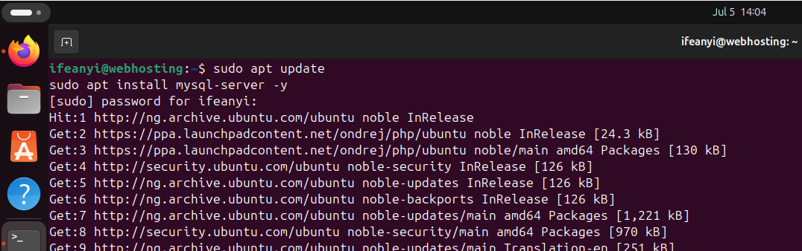
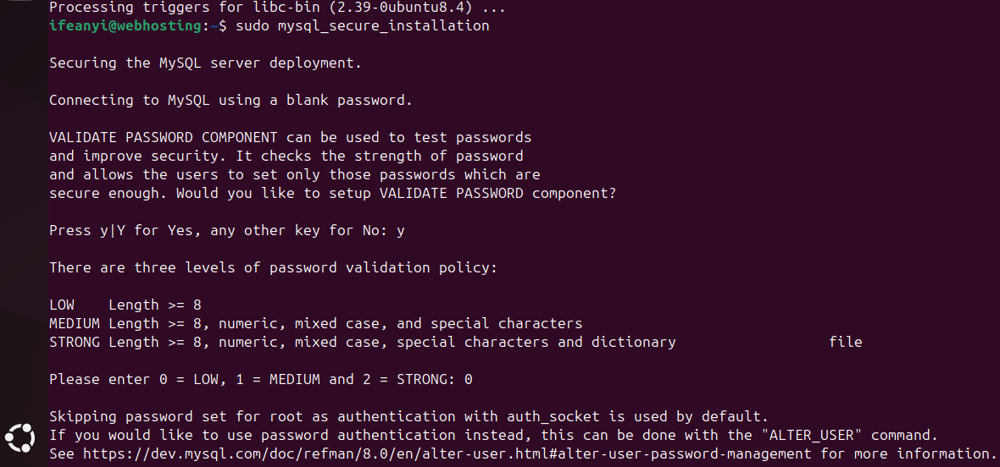
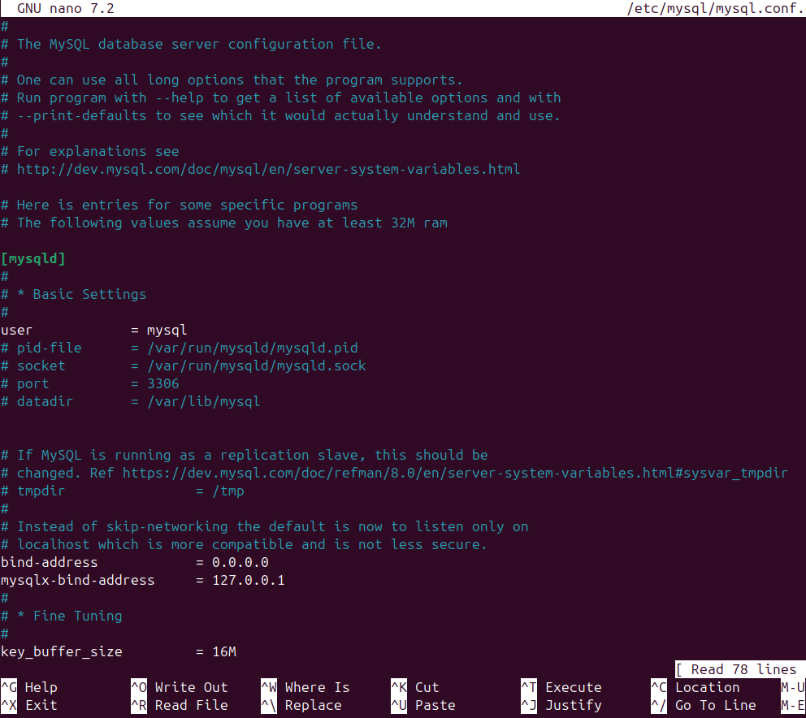
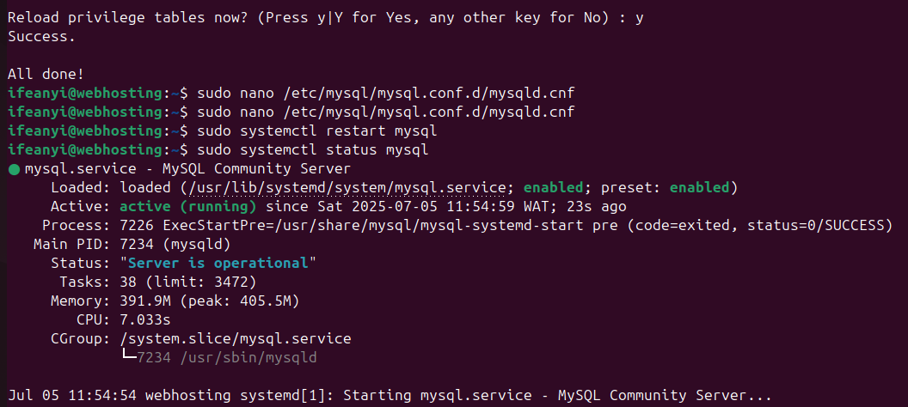
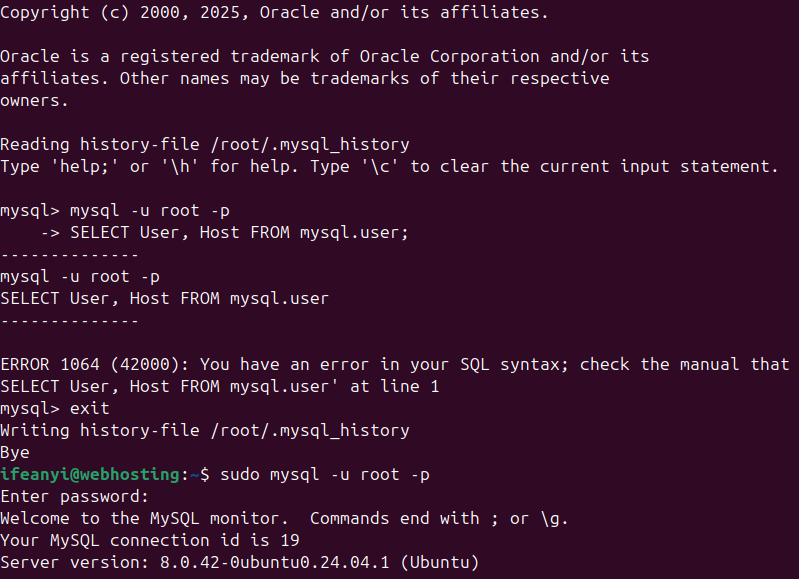

## Installing and Configuring MySQL Server on Ubuntu

This guide outlines the steps to install MySQL Server, secure it, configure network access, and create a new user for remote connections.

**Prerequisites:**

- An Ubuntu-based system.
- `sudo` privileges.

### 1. Update and Refresh System Packages

It's good practice to update your package lists and upgrade existing packages to their latest versions before installing new software.

Bash

`sudo apt update && sudo apt upgrade -y`

### 2. Install MySQL Server

Install the MySQL Server package using `apt`. The `-y` flag automatically confirms the installation.

Bash

`sudo apt install mysql-server -y`

### 3. Secure MySQL Installation

Run the `mysql_secure_installation` script to enhance the security of your MySQL installation. This script guides you through steps like:

- Setting a root password (or changing the existing one).
- Removing anonymous users.
- Disallowing root login remotely.
- Removing the test database.

It is generally recommended to answer `Y` (Yes) to most of the prompts unless you have specific reasons not to.

Bash

`sudo mysql_secure_installation`

### 4. Configure Network Binding Address

By default, MySQL might only listen for connections from the local machine (localhost). To allow remote connections, you need to modify the `bind-address` in the MySQL configuration file.

1. Open the MySQL configuration file using `nano`:Bash
    
    `sudo nano /etc/mysql/mysql.conf.d/mysqld.cnf`
    
2. Locate the line that starts with `bind-address`. It will typically look like this:
    
    `bind-address = 127.0.0.1`
    
3. Change `127.0.0.1` to either:
    - **A specific IP address:** If you want MySQL to only listen on a particular network interface (e.g., `192.168.1.100`).
    - **`0.0.0.0`:** This allows MySQL to listen on all available network interfaces. While convenient, it is generally **not recommended for production environments** as it can expose your database to a wider network than intended. Use with caution and ensure your firewall is properly configured.
    
    For example, to listen on all interfaces:
    
    `bind-address = 0.0.0.0`
    
4. Save the changes:
    - Press `Ctrl + O` (to Write Out).
    - Press `Enter` to confirm the filename.
    - Press `Ctrl + X` (to Exit).

### 5. Restart MySQL Service

After modifying the configuration file, restart the MySQL service for the changes to take effect.

Bash

`sudo systemctl restart mysql`

### 6. Configure Firewall (UFW)

Ubuntu typically uses UFW (Uncomplicated Firewall) by default. You need to open the MySQL default port (3306) to allow incoming connections.

1. **To allow connections from any IP address (less secure, use with caution):**Bash
    
    `sudo ufw allow 3306/tcp`
    
2. **To allow connections from a specific IP address (recommended for security):**Bash
    
    Replace `<IP address>` with the actual IP address you want to allow connections from (e.g., `192.168.1.50`).
    
    `sudo ufw allow from <IP address> to any port 3306`
    
    You can check the firewall status with `sudo ufw status`.
    

### 7. Create a New MySQL User for Remote Access

It's best practice to create a dedicated user for remote connections rather than using the `root` user.

1. Log in to the MySQL server as the `root` user
    
    `sudo mysql -u root -p`
    
    Enter the root password you set during the secure installation.
    
2. Execute the following SQL commands to create a new user, grant privileges, and refresh the privilege tables.
    
    
    SQL
    
    `CREATE USER 'useryouwant'@'%' IDENTIFIED BY 'Choosepassword';
    GRANT ALL PRIVILEGES ON *.* TO 'useryouwant'@'%' WITH GRANT OPTION;
    FLUSH PRIVILEGES;
    EXIT;`
    
    - Replace `'useryouwant'` with your desired username.
    - Replace `'Choosepassword'` with a strong password.
    - `'%'` in `'useryouwant'@'%'` signifies that this user can connect from any host. For increased security, you can replace `'%'` with a specific IP address (e.g., `'192.168.1.50'`) or a network range (e.g., `'192.168.1.%'`).
    - `GRANT ALL PRIVILEGES ON *.*`: Grants all permissions on all databases and tables. In a production environment, it's recommended to grant only the necessary privileges.
    - `WITH GRANT OPTION`: Allows this user to grant privileges to other users.
    - `FLUSH PRIVILEGES`: Reloads the grant tables, ensuring the new user's privileges are active.

### 8. Test the MySQL Setup

You can test the connectivity to your MySQL server in a few ways:

1. **From the same local machine:**  
    
    `mysql -u useryouwant -p -h 127.0.0.1`
    
    Enter the password for `useryouwant`. This tests if the user can connect locally through the configured `bind-address`.
    
2. **Remotely (from another machine):**
    
    Replace `<ipaddress_you_mapped>` with the IP address of your MySQL server (the one you used for `bind-address` or the server's public IP if `0.0.0.0` was set).
    
    `mysql -u useryouwant -p -h <ipaddress_you_mapped>`
    
    Enter the password for `useryouwant`.
    

If the connection is successful, you will be presented with the MySQL command prompt.

---